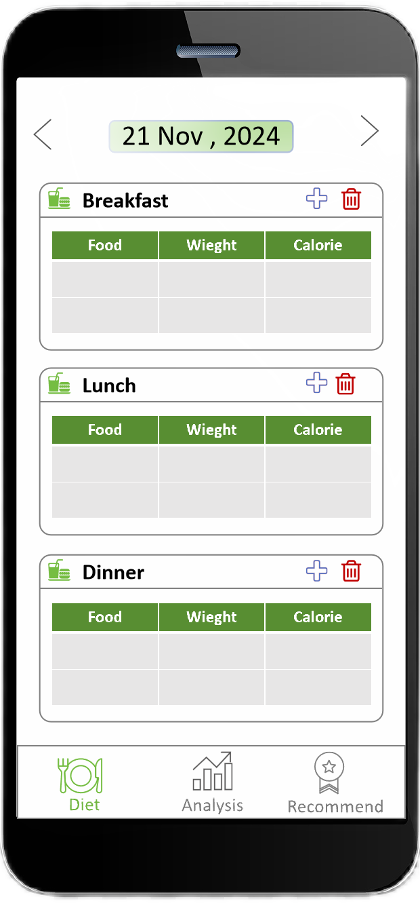
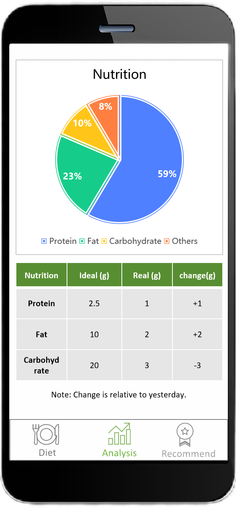
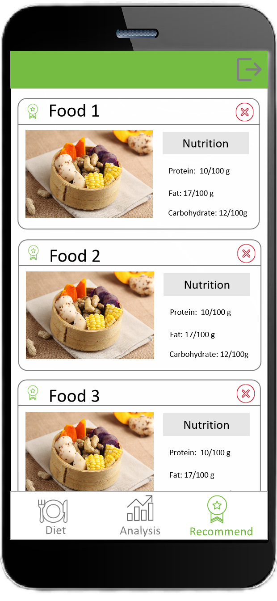

# CS639-Team3
# HealthyEats App

HealthyEats is a simple and practical mobile app that helps you manage your diet and make healthier eating choices. It’s designed to make food tracking, nutritional analysis, and personalized recommendations easy and accessible for everyone.

---

## Features

### Easy Food Logging
Log what you eat with details like food name, quantity, and units. The app automatically retrieves nutritional information using the USDA FoodData Central API and securely stores your data in Firestore.

### Nutritional Analysis
Get an instant breakdown of your daily calorie, protein, carb, and fat intake. The app visualizes this information in clear, easy-to-read charts so you can see how you’re doing at a glance.

### Personalized Recommendations
Based on your food logs, HealthyEats offers tailored suggestions to help you make better dietary choices, including portion sizes and healthier alternatives.

---

## How It Works

1. **Login/Sign Up**: Create an account with your email and password.
2. **Log Your Meals**: Input your meals and let the app handle the rest.
3. **Analyze**: View charts and reports of your nutrition intake.
4. **Improve**: Follow personalized recommendations to eat better.

---

## Technical Overview

- **Frontend**: Built with Kotlin for Android.
- **Backend**: Firebase Authentication for secure login and Firestore for data storage.

## Design

### User Interface

| </img> Login | </img> Sign Up |
| :----------------------------------------------------------: | :----------------------------------------------------------: |
| </img> Log meals | </img> Analyze |
| </img> Improve |                                                              |

**(1) Login/Sign Up:** Create an account and login with user's email and password. Use Firebase Authentication for user authentication.

**(2) Log meals**: Users can log their breakfast, lunch and dinner by inputing food name and weight, and our app will query an API to determine the calories and nutrition of these food. In addition, user can switch the date to look up log history, which is default showing today.

**(3) Analyze**: The nutrition from all the food the user consumes, including proteins, fats, and carbohydrates, will be tracked and displayed in the form of a pie chart. Additionally, the application will compare the actual intake of nutrients with the ideal intake in a table and show the changes in today's nutrient intake compared to yesterday. 

**(3) Recommend**: The application will recommend appropriate meals based on the user's nutritional intake by calling a web API. For example, if the user's protein intake is generally insufficient, the application will recommend protein-rich foods; if the user's fat intake exceeds the recommended level, the application will suggest low-fat foods, and so on.

### Database Entity

**(1) User**

- **Name:** String, user's nick name.
- **Email:** String, user's email.
- **Password:** String, user's password.

User entity is created and managed by Firebase.

**(3) Meal**

- **ID**: String, id of the meal is generated by fire store.
- **Type**: Enum of "breakfast","lunch" or "dinner"
- **Food**: String, name of the food.
- **Weight**: Double, weight of the food.
- **Calorie**: Double, it's value is calculated by the application with a web api.
- **Created At**: Date, date for logging the meal.

Meal entity  is created by user.

**(4) Nutrition**

- **ID**: String, id is generated by firestore.
- **Protein**: Double, the amount of protein consumed, measured in grams.
- **Fat**: Double, the amount of fat consumed, measured in grams.
- **Carbohydrate**: Double, the amount of carbohydrate consumed, measured in grams.
- **Date**: The date on which the nutrition data was recorded.

Nutrition entity is created by application automatically.

**(5) Recommend**

- **ID**: String, id is generated by firestore.
- **Food**: String, name of the food.
- **Protein**: Double, the amount of protein consumed, measured in grams.
- **Fat**: Double, the amount of fat consumed, measured in grams.
- **Carbohydrate**: Double, the amount of carbohydrate consumed, measured in grams.
- **Image**: URL, image URL of the food.

Recommend entity is created by web api and stored in firestore.

---

## Why Choose HealthyEats?

HealthyEats is all about making healthy living easy. Whether you're just starting to track your diet or looking for ways to improve your eating habits, the app provides all the tools you need in one place. It’s simple, accurate, and designed to fit into your everyday life.
